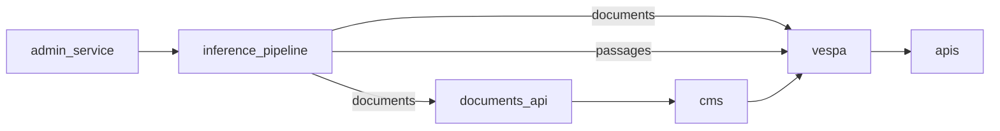

# Documents (spike)

## Running
Check the `justfile` for commands.

## archivtecture diagram

```mermaid
flowchart LR
    admin_service
    inference_pipeline
    vespa
    apis

    documents_api
    cms


    admin_service --> inference_pipeline -- documents --> vespa --> apis
    inference_pipeline -- passages --> vespa
    inference_pipeline -- documents --> documents_api --> cms --> vespa
```